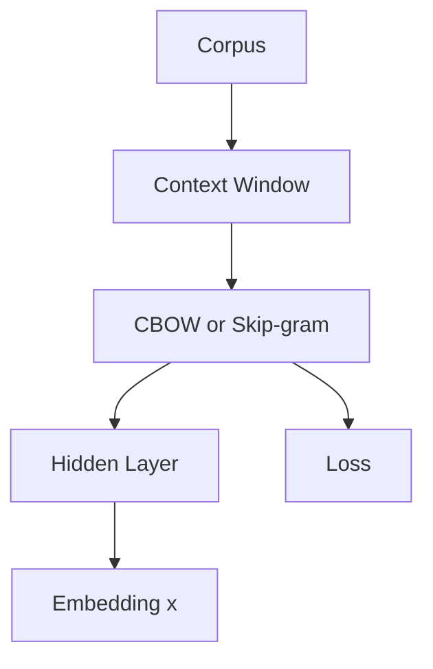
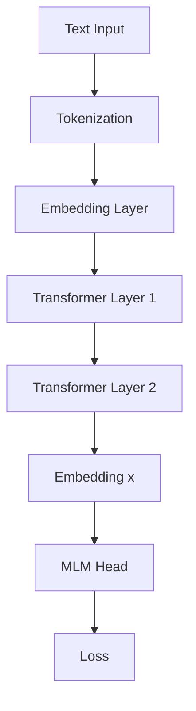
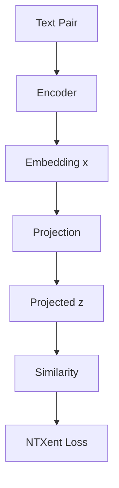
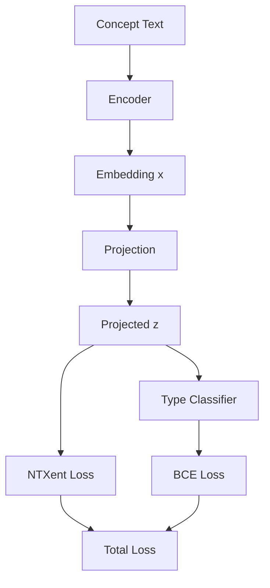

# Biomedical Embedding Study — Projection Head, Ablation, and Architectures

---

## 1. Projection Head

### Why is a projection head used?

The base embedding space learned by Word2Vec or Transformer models is optimized for language modeling, not for contrastive alignment.

We introduce a projection head:

x in R^d  
z = g(x)

This enables:
- preservation of base semantics  
- task-specific restructuring of embedding space  

---

### How is it trained?

Using NT-Xent Loss:

L = -log( exp(sim(z_i, z_j) / tau) / sum exp(sim(z_i, z_k) / tau) )

Where:
- z_i, z_j → positive pairs (synonyms or relations)  
- z_k → negatives  
- tau → temperature  

Full enhanced loss:

L = L_ntxent + lambda * L_type

---

### How is it used?

- Base mode: x  
- Projected mode: z = g(x)  

Projected embeddings are used for:
- retrieval  
- link prediction  
- relation probing  

---

## 2. Ablation Study

### Variants

| Model | Components |
|------|-----------|
| Baseline | None |
| UMLS | Synonym alignment |
| Synonym Only | Clean contrastive |
| Synonym + Type | + classification |
| Synonym + Relation | + relations |
| Full Enhanced | All |

---

### Findings

- Synonyms → semantic clustering  
- Types → small classification gain  
- Relations → major improvement in MRR, AUC  

### Trade-off

- Relations increase → retrieval increases  
- Relations increase → type F1 decreases  

### Key Insight

Semantic similarity is NOT equal to relational understanding

---

## 3. Architectures

---

### 3.1 Word2Vec Base Model



---

### 3.2 Transformer Base Model



---

### 3.3 UMLS Alignment Model



---

### 3.4 Enhanced Model



---

### 3.5 Residual Variant

```mermaid
flowchart TD
    A[Embedding x] --> B[Projection g(x)]
    A --> C[Skip Connection]
    B --> D[Add]
    C --> D
    D --> E[Final z]
```

---

## 4. Final Conclusion

- Projection head isolates alignment learning  
- Synonym alignment alone is insufficient  
- Type supervision gives marginal gains  
- Relation learning is the dominant factor  

While synonym learning builds the embedding space, relational supervision gives it meaning.
