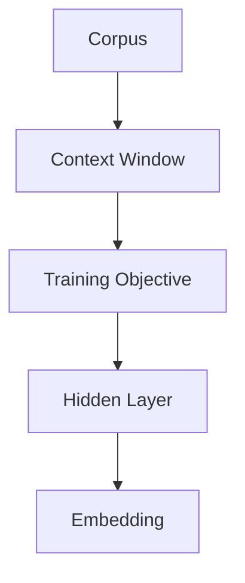
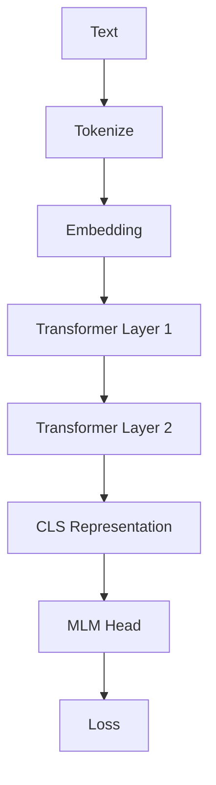
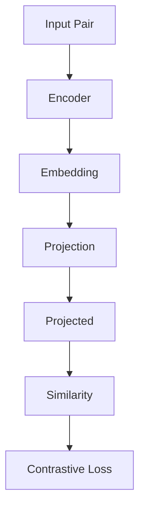
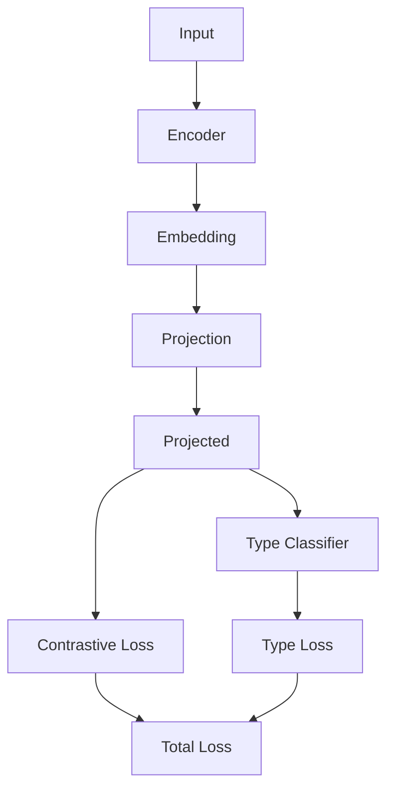
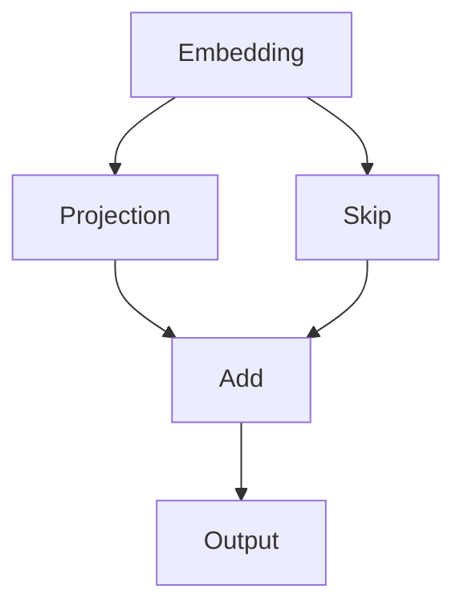

# Biomedical Embedding Study — Clean GitHub Version

---

## 1. Projection Head

### Why used
Base embeddings are optimized for language modeling, not contrastive alignment.

We use:
x in R^d  
z = g(x)

Projection allows:
- preserving base embedding
- learning task-specific space

---

### Training

NT-Xent Loss:

L = -log( exp(sim(zi, zj)/tau) / sum exp(sim(zi, zk)/tau) )

---

### Usage

- base embedding: x  
- projected embedding: z  

---

## 2. Ablation Study

Models:

- baseline  
- umls  
- synonym only  
- synonym + type  
- synonym + relation  
- full enhanced  

Findings:

- synonyms → clustering  
- types → small gain  
- relations → major improvement  

---

## 3. Architectures

### 3.1 Word2Vec

---

### 3.2 Transformer (Exact from config)

- Layers: 2
- Heads: 4
- Hidden size: 128
- FFN dim: 256
- Max length: 32
- Mask probability: 0.15

---

### 3.3 Alignment

---

### 3.4 Enhanced Model

---

### 3.5 Residual Variant

---

## 4. Conclusion

- projection isolates learning
- synonym alone insufficient
- relations most important
