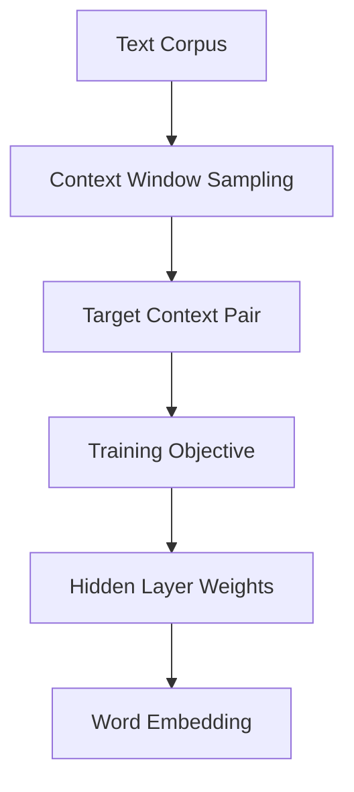
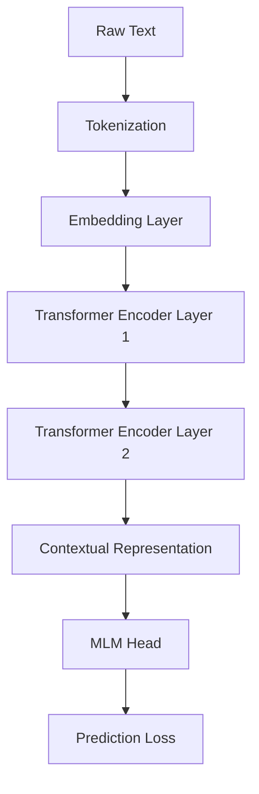
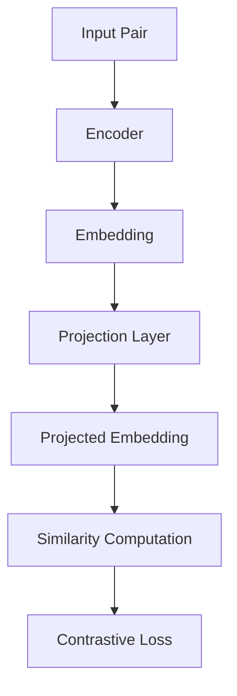
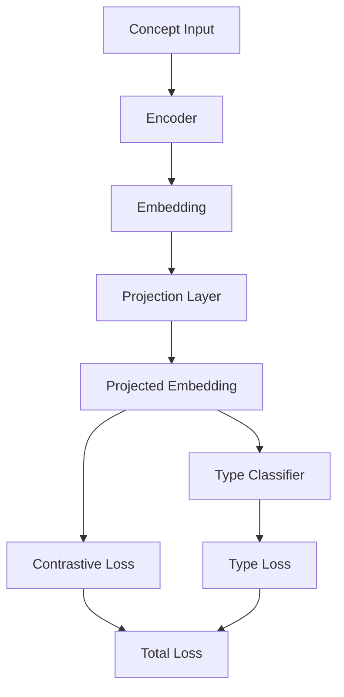

# Biomedical Embedding Study — Final Report (GitHub Safe + Detailed)

---

## 1. Projection Head

### Why used
Base embeddings from Word2Vec and Transformer are trained for language modeling, not contrastive or relational tasks.

We introduce:
x in R^d  
z = projection(x)

This allows:
- preserving base embedding structure  
- learning task-specific transformations  

---

### Training

NT-Xent Loss:

L = -log( exp(sim(zi, zj) / tau) / sum exp(sim(zi, zk) / tau) )

Where:
- zi, zj = positive pairs  
- zk = negatives  

---

### Usage

- base embedding → general semantic tasks  
- projected embedding → retrieval, relation tasks  

---

## 2. Ablation Study

### Models

- baseline  
- umls alignment  
- synonym only  
- synonym + type  
- synonym + relation  
- full enhanced  

---

### Findings

- synonyms → semantic grouping  
- types → minor classification improvement  
- relations → major improvement in retrieval  

---

## 3. Architectures

---

## 3.1 Word2Vec Base Model

### Description

Word2Vec learns embeddings using context prediction:

1. A sliding window extracts surrounding words  
2. Model predicts context given a target word (or vice versa)  
3. Hidden layer weights become embeddings  
4. Embeddings capture co-occurrence relationships  

This produces strong semantic similarity but lacks relational understanding.

---

## 3.2 Transformer Base Model

### Description

The transformer model:

1. Tokenizes input text  
2. Converts tokens to embeddings  
3. Passes through 2 encoder layers with attention  
4. Produces contextual embeddings  
5. Trains using masked language modeling  

This captures context but does not encode structured medical relationships.

---

## 3.3 UMLS Alignment Model

### Description

This stage aligns embeddings:

1. Input synonym pairs are encoded  
2. Base embeddings are projected to a new space  
3. Similarity is computed between pairs  
4. NT-Xent loss pulls similar concepts together  

This improves semantic consistency but still lacks relational structure.

---

## 3.4 Enhanced Model

### Description

The enhanced model introduces structured supervision:

1. Embeddings are projected into alignment space  
2. Contrastive loss uses:
   - synonym pairs  
   - relation pairs  
3. Type classifier predicts semantic categories  
4. Final loss combines both objectives  

Key improvement:
- relations are injected as positive pairs  
- embedding space captures real-world connections  

---

## 4. Final Conclusion

- Word2Vec captures semantic similarity  
- Transformer captures contextual meaning  
- Projection head enables task-specific learning  
- Synonym alignment alone is insufficient  
- Relation learning is the dominant factor  

Final insight:

Embedding models require explicit supervision to learn meaningful relationships, not just similarity.
